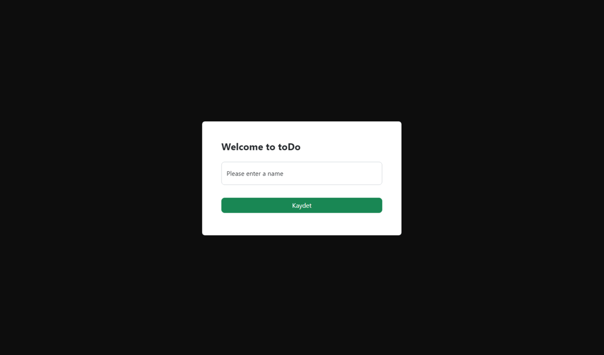

# toDo


## Description 

**toDo is a to-do application built with React and MockAPI.**. This project was created for both learning React and for the [Popupsmart React Practicum](https://www.patika.dev/bootcamp/popupsmart-react-practicum), which was created with Patika.dev and Popupsmart..

## Setup

To run this project, install it locally using npm:

For Windows

``` cmd
> npm install
> npm start
```

## Features

### Project Status

- The project is running. It has its deficiencies and needs further development. Please contact me if you have any bugs, deficiencies, or improvement ideas you see.

## Contact

Created by [@Abdullah Böğrek](https://tr.linkedin.com/in/abdullah-s-bogrek) - feel free to contact me!

Mail: asbogrek@gmail.com

## License

This project is open source and available under the [MIT](https://opensource.org/licenses/MIT).
