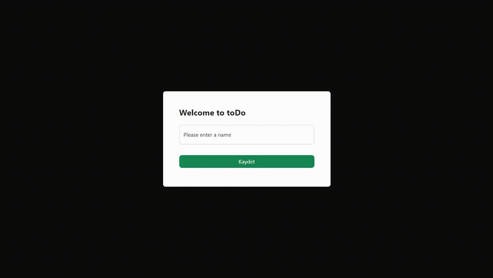
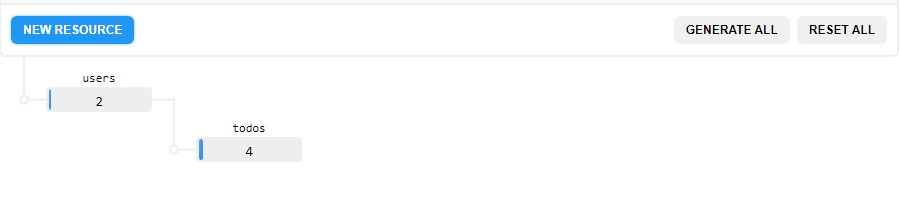
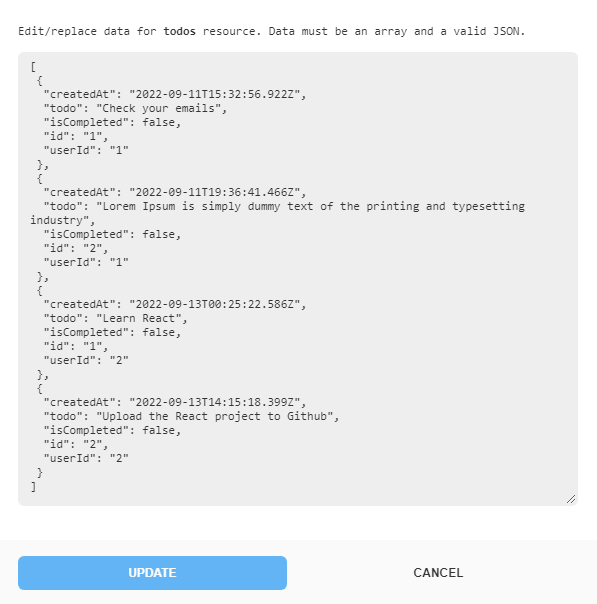
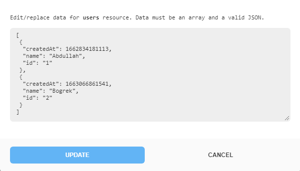

# toDo


## Description 

**toDo is a to-do application built with React and MockAPI.** This project was created for both learning React and for the [Popupsmart React Practicum](https://www.patika.dev/bootcamp/popupsmart-react-practicum), which was created with Patika.dev and Popupsmart.

The API endpoint of the project is provided with MockAPI. The following is a diagram of the API endpoint. The to-do list was created, updated, deleted, and listed using this endpoint. Each user's to-do list is saved under their own API endpoint, and the name information obtained from the user is saved in local storage.





## Setup

To run this project, install it locally using npm:

For Windows

``` cmd
> npm install
> npm start
```

## Features

- Dark Theme
- You can create a to-do list.
- You can update your to-do list.
- You can remove items from your to-do list.
- You can update your name.
- You can mark the tasks you've finished.

### To Do

- Filter to-do list.
- Refactoring the code.

### Project Status

- The project is currently working. It has all the requirements for the case. The project is flexible, and I intend to keep developing it. If you find any issues or have any ideas, please do contact me.

## Contact

Created by [@Abdullah Böğrek](https://tr.linkedin.com/in/abdullah-s-bogrek) - feel free to contact me!

Mail: asbogrek@gmail.com

## License

This project is open source and available under the [MIT](https://opensource.org/licenses/MIT).
